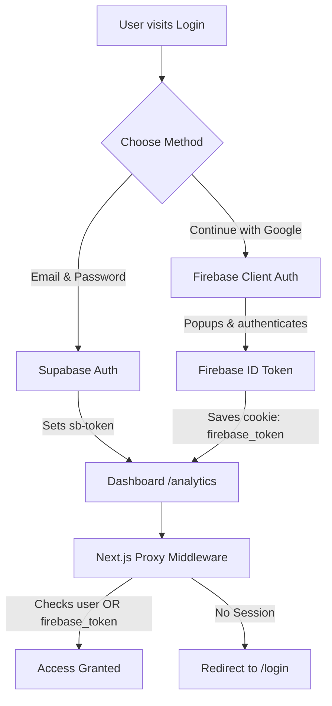

# 🧠 HireIQ — Project Context & Architecture

HireIQ is a premium, enterprise-grade, AI-powered recruitment automation and candidate screening platform. It leverages state-of-the-art semantic matching models to parse resumes, rank candidates against Job Descriptions (JDs), analyze cognitive bias, and streamline recruiter pipelines.

---

## 🛠️ Technology Stack

1. **Frontend / Core Framework**: Next.js 16.2.6 (App Router) with TypeScript.
2. **Database & Storage**: Supabase (PostgreSQL) for records storage (candidates, jobs, scoring, events) and raw resume document parsing storage.
3. **Authentication Layer**: Dual-Auth system:
   - **Email/Password**: Powered directly by Supabase Auth.
   - **Google Social Sign-in**: Powered by **Firebase Authentication** (`signInWithPopup`) with a custom cookie-based proxy middleware.
4. **Styling**: Vanilla CSS utilizing custom HSL design tokens, responsive breakpoints, smooth animations, and glassmorphic off-white/olive tones.
5. **Testing**: Fast, lightweight custom TypeScript unit test runner using `tsx` for sub-second execution.

---

## 📂 Core Directory Structure

```text
hireiq-app/
├── src/
│   ├── app/                # Next.js App Router pages and API routes
│   │   ├── analytics/      # Recruiting & metrics dashboard
│   │   ├── api/            # Server endpoints (upload, scoring, bias detection)
│   │   ├── login/          # Custom Glassmorphic credentials page
│   │   └── pipeline/       # Kanban-style applicant tracking pipeline
│   ├── components/         # Premium UI & reusable layout components
│   │   └── ui/             # ScoreBar, SearchModal, and dialog boxes
│   └── lib/                # Utility helpers, client interfaces, and tests
│       ├── firebase.ts     # Firebase Auth instance initialization
│       ├── supabase.ts     # Supabase DB client and type assertions
│       └── utils.ts        # Formatting, scoring, color maps, and date math
├── CONTEXT.md              # Project architecture & context mapping (this file)
├── DATABASE_SECURITY.md    # Security schema & Row Level Security (RLS) details
├── API.md                  # Comprehensive backend API endpoints manual
├── README.md               # Local development setup & docker-compose manual
└── package.json            # Lockfiles & dependencies registry
```

---

## 🔐 Authentication Architecture

To maximize ease of integration, HireIQ employs a unique **Dual-Auth Strategy** bridging Supabase and Firebase:



### Route Guard Middleware (`src/proxy.ts`)
The server-side proxy middleware intercepts requests to protected routes (`/analytics`, `/upload`, `/candidates/*`). Access is approved if:
1. A valid Supabase server session user is detected.
2. **OR** a `firebase_token` cookie is present on the incoming request header.

---

## 🗄️ Database & Schema Constraints

HireIQ connects directly to Supabase PostgreSQL. Details regarding table structure, fields, and custom policies can be found in [DATABASE_SECURITY.md](file:///Users/pratikshinde/Desktop/HireIQ/DATABASE_SECURITY.md).

- **`candidates`**: Store candidate profiles, emails, locations, and AI-extracted skills.
- **`jobs`**: Store job descriptions, departments, and required skills.
- **`candidate_scores`**: Calculated metrics ranking matching scores, matched skills, and reasoning analysis.
- **`bias_flags`**: Tracks cognitive, ageist, gender, and school biases detected during resume scans.

---

## ⚡ Test Suite Architecture

HireIQ values robust code quality. Our lightweight unit test runner `src/lib/test-runner.ts` tests **32 distinct scenarios** spanning:
1. **Date Formatting**: `fmtDate` and `fmtRelative` checking null values, invalid strings, and correct time difference strings.
2. **Range Math**: `clamp` verifying bounds under extreme, positive, negative, and equal limits.
3. **Match Indicators**: `scoreColor` and `scoreBadgeClass` evaluating green, yellow, and red status highlights.
4. **Data Parsers**: `initials` extraction, deterministic `nameToHue` color mapping, clean text `truncate` logic, and complex semicolon/comma/newline skills list separators (`parseSkillsText`).

*To execute tests at any time, run:*
```bash
npm run test
```

---

## 📈 Local Environment Setup

Ensure the following local variables are configured inside your `.env.local` file:

```env
# Supabase
NEXT_PUBLIC_SUPABASE_URL=https://your-project.supabase.co
NEXT_PUBLIC_SUPABASE_ANON_KEY=your-anon-key

# Firebase
NEXT_PUBLIC_FIREBASE_API_KEY=your-api-key
NEXT_PUBLIC_FIREBASE_AUTH_DOMAIN=your-project.firebaseapp.com
NEXT_PUBLIC_FIREBASE_PROJECT_ID=your-project-id
NEXT_PUBLIC_FIREBASE_STORAGE_BUCKET=your-project.appspot.com
NEXT_PUBLIC_FIREBASE_MESSAGING_SENDER_ID=your-sender-id
NEXT_PUBLIC_FIREBASE_APP_ID=your-app-id
```
